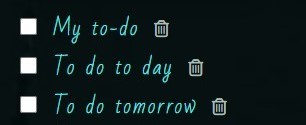
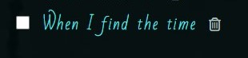

# To-Do List

#### [\[View the live project here\]](https://linnsilver.github.io/to-do-list-pj2/)
A To-Do List with is a modern romantic design. Providing an easy to use and a comfortable way to have control over users to-dos.  With time square in monochrome at the background and soft corners to every edge, it gives a calm and still active expression without being boring.

## 

# UX User experience

This easy to use to-do list provides a quick way for the user to keep track of to-dos. The first section contains the uncompleted tasks, with a checkbox to check completed tasks and a trashcan to remove tasks that don't need to be completed. When a task been checked, it moves to completed section to make it easy for user to see what have been achieved. The background to the list is darker to make text easier to read. Input field, checkbox and trashcan are provided with aria labels for users how use screen readers. Uncompleted tasks are stored locally, so the page can be refreshed without loosing content.

#  Features

### Create new task
By writing new task in the input field and clicking button Create new task or by simply clicking enter key, you will create a new to-do task. It's easier for the user to be able to chose how to submit to list.
## 

### Try to submit empty input field
An attempt to submit an empty input field, or only blanks, will produce an alert who asks the user to write something.
## 

### Checkbox on task
Every uncompleted task have a checkbox to mark when the task is completed. When checked, the task moves to completed section. The checkbox is now checked.
## 

### Delete task
Every uncompleted task is equipped with a trashcan button, when clicked the task is deleted. Sometimes a User wants to remove an uncompleted task, this makes it possible to do that.
## 

### Clear all completed tasks
Clicking the Clear completed button clears out all completed tasks. Reload page will do the same. It's sometimes convenient for user to see which tasks have been completed, still saving them too long will just be cluttered, why it's better for the user that the completed list is deleted on page refresh.
## 

### Cursor focus 
To make it easier for the user to add the task, the cursor will be in focus in the input field when the page is loaded, and after every completed task.

###  Favicon
Favicon icon on the tab in the browser. Makes it easier for the user to find the page if there are many open tabs.
## 

### Features to implement later
Edit to do tasks.

# Technologies

-   JavaScript
-   HTML
-   CSS
-   GitHub
-   GitHub Pages
-   Gitpod
-   Google Fonts
-   Font Awesome
-   JSON

## Testing

-   HTML  **W3C tools**
## 

-   CSS  **W3C tools**
## 

-   Lighthouse In DevTools
## 

### Browser Compatibility

The following browsers have been tested:

-   Chrome Version 108.0.5359.125
-   Mozilla Firefox Version 108.0.1
-   Edge Version 108.0.1462.54
-   Opera Version 89.0.4447.91
-   Safari on macOS Version 16.1

Tested on hardware:

-   Asus laptop 17 inch
-   MacBook Pro 16 inch
-   MacBook Pro 15 inch
-   Desktop: 2560 wide monitor to MacBook

### Mobile responsiveness testing.

Chrome Developer tools were used for more extensive testing.

Following mobiles has been tested:

-   iPhone 5 / SE
-   iPhone 7
-   iPhone Pro Max
-   Samsung Galaxy a52s
-   Huawei P20 pro
-   Sony Xperia 5 III

### Manual testing

|Function          |Expected outcome                  |Results              |
|----------------|-------------------------------|-----------------------------|
|Lode page                      |Cursor focus to input field           |Pass |
|After creating new task        |Cursor focus to input field            |Pass |
|Pressing **enter key** with empty input field          |Alert message: Please write something |Pass |
|Click **Create task** button with empty input field    |Alert message: Please write something     |Pass |
|Click **Create task** button with content in input field  |Creates new to do task	|Pass  |
|Press **enter key** with content in input field        |Creates new to do task    |Pass |
|Click checkbox in front of uncompleted task            |Moves task to completed section      |Pass |
|Click trashcan icon 	        |Delete task at same row			|Pass |
|Click **Clear completed** button deletes all completed tasks |Delete all completed tasks    |Pass |
|Refresh webpage                |All undone tasks: Reload. All completed tasks: Delete  |Pass |
|Mouse hover over trashcan                          |Cursor changes to hand pointer           |Pass |
|Trying to write machine code in input field  |special characters, /(<([^>]+)> disappears from created task  |Pass |

## Deployment

Create a  [fork of the repository.](https://docs.github.com/en/get-started/quickstart/fork-a-repo#forking-a-repository)

1.  Log in to GitHub and go to repository: LinnSilver/Project1-todolistpj2
2.  Click button fork -Create a new fork.
3.  Choose repository name.
4.  Click Create fork.

Now you have a fork of the repository in your repository. To access code:

5.  In your new repository:
6.  Click green button: Code arrow down.
7.  Choose: Create codespace on main - Code is opened in a web codespace.

After this, you do not have the files in the repository locally on your computer. To save a copy locally on your computer:

9.  On GitHub.com, navigate to your fork of the repository.
10.  Above the list of files, click Code, Local.
11.  Copy the URL for the repository.
12.  Open Git Bash.
13.  Change the current working directory to the location where you want the cloned directory.
14.  Type  `git clone`, and then paste the URL you copied earlier.
15.  Press Enter. Your local clone will be created.

It's important to commit and push correctly. Read more here:

-   [How to commit and push code from local file system to GitHub Pages.](https://docs.github.com/en/desktop/contributing-and-collaborating-using-github-desktop/making-changes-in-a-branch/committing-and-reviewing-changes-to-your-project)

After every change in the code, it's important to redo the test section. Go through:

-   HTML W3C tools
-   CSS W3C tools
-   Lighthouse In DevTools
-   Browser Compatibility
-   Mobile Compatibility
-   Manual testing

## Credits

### Content

All content on this webpage was written by the developer.

### Media

- Image. Background image were downloaded from [Freeimages.com]
- Google font -Font type Bad Script is imported from Google font.
- Font awesome -Provided check icon in header and trashcan for delete.
- Favicon -Favicon icon on tab was produced with Favicon.
- Alert message was downloaded from https://sweetalert2.github.io/
- Button style and input field style wad inspired from https://flowbite.com/docs/components/buttons/ and had a makeover.

### Acknowledgments

Thank you to my mentor Brian Macharia. For Your support and guidance. Your great knowledge and commitment during this project has made my project better and more enjoyable.
